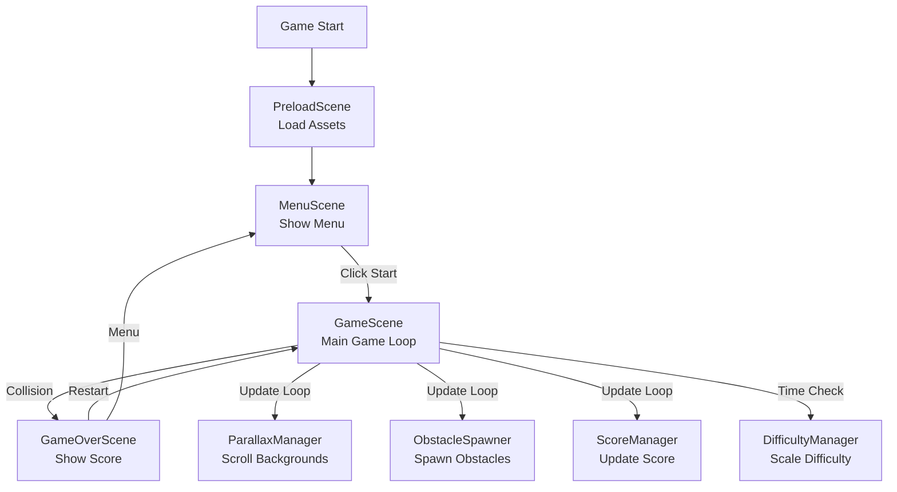

# Endless Runner Game Development Plan

## Overview

Create a complete Endless Runner game using Phaser 3.x with parallax scrolling, jump mechanics, procedural obstacles, collision detection, scoring, difficulty scaling, and responsive design. The project will be organized with modular code structure and support both desktop and mobile platforms.

## Project Structure

```
HTML 5 Week 7/
├── index.html                 # Main HTML file
├── plan.md                    # This planning document
├── css/
│   └── style.css             # Global styles and responsive utilities
├── js/
│   ├── main.js               # Game initialization and Phaser config
│   ├── scenes/
│   │   ├── PreloadScene.js   # Asset loading scene
│   │   ├── MenuScene.js      # Main menu scene
│   │   ├── GameScene.js      # Main game scene
│   │   └── GameOverScene.js  # Game over screen
│   ├── entities/
│   │   ├── Player.js         # Player character class
│   │   └── Obstacle.js        # Obstacle class
│   ├── managers/
│   │   ├── ParallaxManager.js # Parallax background manager
│   │   ├── ObstacleSpawner.js # Procedural obstacle spawning
│   │   ├── ScoreManager.js    # Score tracking and display
│   │   └── DifficultyManager.js # Difficulty scaling
│   └── config/
│       └── gameConfig.js      # Game configuration constants
└── assets/
    ├── images/
    │   ├── player/            # Player sprites
    │   ├── obstacles/         # Obstacle sprites
    │   └── backgrounds/       # Background layers
    └── audio/                 # Sound effects (optional)
```

## Implementation Phases

### Phase 1: Project Setup & Core Structure
- Set up HTML file with Phaser 3 CDN
- Create folder structure
- Configure Phaser game instance with responsive scale manager
- Set up scene system (Preload, Menu, Game, GameOver)
- Create game configuration file with all constants

### Phase 2: Player & Physics
- Implement Player class with sprite and animations
- Add automatic horizontal movement
- Implement jump mechanics (tap/click input)
- Configure gravity and ground collision
- Add running animation loop

### Phase 3: Parallax Background System
- Create ParallaxManager class
- Implement 2+ scrolling background layers with different speeds
- Set up seamless looping backgrounds
- Integrate with game scene

### Phase 4: Obstacle System
- Create Obstacle class
- Implement ObstacleSpawner with random interval logic
- Add obstacle movement (left scrolling)
- Implement obstacle cleanup when off-screen
- Create obstacle pool for performance

### Phase 5: Collision Detection & Game States
- Implement collision detection between player and obstacles
- Add Game Over state trigger
- Create GameOverScene with score display
- Add restart functionality
- Implement scene transitions

### Phase 6: Scoring & Difficulty
- Create ScoreManager for tracking distance/obstacles passed
- Add real-time score display UI
- Implement DifficultyManager for speed scaling
- Add difficulty increase after 30 seconds
- Store high score (localStorage)

### Phase 7: Responsive Design & Mobile Support
- Configure Phaser Scale Manager for responsive scaling
- Implement touch input handlers for mobile
- Add viewport meta tag optimization
- Test and adjust for various screen sizes
- Ensure tap input works smoothly on mobile

### Phase 8: Polish & Optimization
- Add visual feedback (particles, effects)
- Optimize obstacle spawning logic
- Add sound effects (optional)
- Improve UI/UX with better fonts and styling
- Code cleanup and documentation

## Key Technical Details

### Responsive Design Approach
- Use Phaser's Scale Manager with `FIT` mode for responsive scaling
- Set up proper viewport meta tags
- Use percentage-based or flexible sizing for UI elements
- Test on multiple screen sizes (mobile, tablet, desktop)

### Input Handling
- Desktop: Mouse click and keyboard spacebar
- Mobile: Touch/tap events
- Use Phaser's input system for cross-platform compatibility

### Performance Considerations
- Object pooling for obstacles
- Efficient parallax layer rendering
- Proper cleanup of off-screen objects
- Optimized collision detection (using Phaser's built-in physics)

### Code Organization Principles
- Modular classes for reusability
- Configuration-driven design (easy to tweak values)
- Separation of concerns (managers handle specific systems)
- ES6+ syntax (classes, arrow functions, const/let)

## Files to Create/Modify

1. **index.html** - Main HTML structure with Phaser CDN
2. **css/style.css** - Responsive styles and UI styling
3. **js/main.js** - Phaser game initialization
4. **js/config/gameConfig.js** - All game constants (gravity, jump force, speeds, etc.)
5. **js/scenes/PreloadScene.js** - Asset loading
6. **js/scenes/MenuScene.js** - Main menu
7. **js/scenes/GameScene.js** - Main game logic
8. **js/scenes/GameOverScene.js** - Game over screen
9. **js/entities/Player.js** - Player character class
10. **js/entities/Obstacle.js** - Obstacle class
11. **js/managers/ParallaxManager.js** - Parallax background system
12. **js/managers/ObstacleSpawner.js** - Obstacle spawning logic
13. **js/managers/ScoreManager.js** - Score tracking and display
14. **js/managers/DifficultyManager.js** - Difficulty scaling system

## Game Flow Diagram



## Implementation Tasks

### Task 1: Setup Project Structure
- [ ] Create project folder structure (css/, js/scenes/, js/entities/, js/managers/, js/config/, assets/)
- [ ] Set up index.html with Phaser 3 CDN and responsive viewport
- [ ] Create gameConfig.js with all game constants (gravity, jump force, speeds, spawn intervals, difficulty scaling values)

### Task 2: Phaser Initialization
- [ ] Set up main.js with Phaser game instance
- [ ] Configure responsive scale manager
- [ ] Register all scenes (Preload, Menu, Game, GameOver)

### Task 3: Scenes Setup
- [ ] Create PreloadScene.js for asset loading
- [ ] Create MenuScene.js with start button
- [ ] Create GameScene.js structure
- [ ] Create GameOverScene.js structure

### Task 4: Player Implementation
- [ ] Create Player.js class with sprite
- [ ] Add running animation
- [ ] Implement jump physics (gravity, jump force)
- [ ] Add input handlers (click/tap/spacebar)
- [ ] Configure ground collision

### Task 5: Parallax Background System
- [ ] Create ParallaxManager.js
- [ ] Implement 2+ scrolling background layers at different speeds
- [ ] Set up seamless looping backgrounds
- [ ] Integrate with GameScene

### Task 6: Obstacle System
- [ ] Create Obstacle.js class
- [ ] Create ObstacleSpawner.js with random interval spawning
- [ ] Implement left movement and cleanup logic
- [ ] Add obstacle pool for performance

### Task 7: Game Scene Integration
- [ ] Integrate Player, ParallaxManager, ObstacleSpawner in GameScene
- [ ] Set up basic game loop
- [ ] Implement collision detection between player and obstacles
- [ ] Trigger Game Over on collision

### Task 8: Scoring System
- [ ] Create ScoreManager.js for tracking distance/obstacles passed
- [ ] Display score UI in real-time
- [ ] Store high score in localStorage
- [ ] Show high score in GameOverScene

### Task 9: Difficulty Scaling
- [ ] Create DifficultyManager.js
- [ ] Increase game speed after 30 seconds
- [ ] Integrate with ObstacleSpawner and ParallaxManager
- [ ] Adjust spawn rates based on difficulty

### Task 10: Game Over & Restart
- [ ] Complete GameOverScene.js showing final score
- [ ] Add restart button that returns to GameScene
- [ ] Add menu button to return to MenuScene
- [ ] Implement scene transitions

### Task 11: Responsive Design
- [ ] Configure Phaser Scale Manager for responsive scaling
- [ ] Add CSS for mobile optimization
- [ ] Test on various screen sizes (mobile, tablet, desktop)
- [ ] Ensure proper viewport configuration

### Task 12: Mobile Input
- [ ] Ensure touch/tap input works smoothly on mobile devices
- [ ] Test jump responsiveness
- [ ] Optimize for mobile performance

### Task 13: Polish & Optimization
- [ ] Add visual polish (particles, effects)
- [ ] Optimize performance (object pooling)
- [ ] Code cleanup and documentation
- [ ] Add sound effects (optional)

## Acceptance Criteria Checklist

- [ ] Parallax scrolling backgrounds (2+ layers)
- [ ] Player runs automatically with animation
- [ ] Jump mechanics (tap/click to jump)
- [ ] Gravity and ground collision
- [ ] Procedural obstacle spawning
- [ ] Collision detection (Game Over on hit)
- [ ] Real-time score system
- [ ] Game Over screen with restart
- [ ] Difficulty scaling (speed increases over time)
- [ ] Responsive design (mobile + desktop)
- [ ] Touch input support for mobile
- [ ] Modular, well-organized code structure
- [ ] ES6+ syntax throughout

## Week 7 Training Objectives Coverage

### Concepts to Explain:
- ✅ How parallax scrolling backgrounds are implemented
- ✅ How jump physics are handled in Phaser
- ✅ How procedural spawning of obstacles is coded

### Technical Ability to Demonstrate:
- ✅ Background scrolls endlessly with parallax effect
- ✅ Player runs automatically and jumps on tap/click
- ✅ Obstacles spawn randomly and move left
- ✅ Collision detection triggers Game Over
- ✅ Score increases over time or per obstacle passed
- ✅ Game Over + Restart button implemented
- ✅ Difficulty increases as game progresses

### Code Quality Requirements:
- ✅ Obstacle spawning logic modular
- ✅ Jump physics variables configurable (gravity, jump force)
- ✅ Uses Phaser features (groups, tweens, physics)
- ✅ Code uses ES6+ syntax and is well-structured

### Mobile Compatibility:
- ✅ Tap input triggers jump smoothly on touch devices
- ✅ Game scales properly on mobile screens

## Deliverables

- [ ] A playable Endless Runner (Side-Scrolling) game (desktop + mobile)
- [ ] Code hosted on GitHub (or similar)
- [ ] Short demo video showing desktop click jump and mobile tap jump

